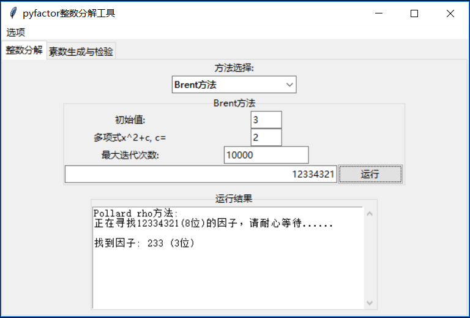
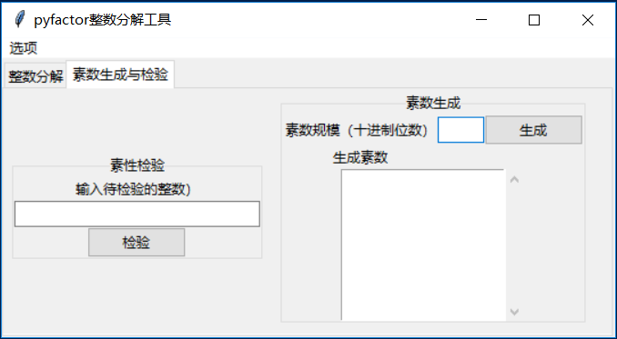

# pyfactor

## 基于python的整数分解工具

### 介绍

pyfactor是一个完全使用python编写的整数分解工具，最大可以分解十进制60位以内的RSA数n=pq。

这个工具是我的毕业设计作品，纯粹是一个实验性质的小程序，和目前程序的整数分解工具
（如：msieve，yafu等等）相比，运行效率很低。但其分解能力可以完全胜任教学目的

支持的python版本：3.5以上

依赖的库：SymPy（推荐版本为1.3以上）

建议直接安装Python科学计算的发行版——Anaconda，默认就预装了常见的python的科学计算库。

目前只提供了核心算法包pyfactor、命令行（CLI）工具pyfactor_cli.py。

图形界面（GUI）工具pyfactor_gui.py正在开发中，使用python默认的GUI套件tkinter。

CLI版本只完成了一个粗糙的原型，而**GUI版本可以单独设置参数、调用具体的算法**，

因此，**推荐学弟学妹使用GUI版本**


### 关于帮助文档

在doc文件中的算法介绍其实是我毕业论文中的一个片段，可以帮助同学们理解pyfactor中使用的整数分解算法。

如果要深入了解某个算法，或者想要改进算法的话，推荐同学们阅读参考文献中列出的论文。

### 算法介绍


pyfactor使用了如下的整数分解算法

* Pollard's rho (Brent改进方法)
* Pollard's p+1
* Williams p-1
* ECM (椭圆曲线因子分解算法)
* SIQS (二次筛法)

其中 p-1方法 和 p+1方法实现了原始论文的第一阶段算法；
ECM方法目前还不稳定，找到十进制20位以下的素因子应该没问题；
SIQS方法寻找光滑数仍然较慢，分解50位以下的整数应该没问题；

### 使用说明


1. pyfactor依赖SymPy，使用前需要安装SymPy
2. 该工具的目标人群是学习整数分解算法的学弟学妹，对于较大的整数运行效率慢的话，请不要吐槽（逃……）
3. pyfactor目前提供了一个命令行（CLI）工具 —— pyfactor_cli.py，
   在命令行下运行 pyfactor_cli.py，可以使用本工具。
4. 图形界面（GUI）工具 —— pyfactor_gui.py使用python tkinter开发，可以在界面中选择单独的算法。
5. 如果想要单独调用某个整数分解算法的话，可以直接调用pyfactor这个python包
6. 使用过程中遇到问题，可以联系1368753673\@qq.com

#### pyfactor_cli 命令行工具

pyfactor_cli命令行工具依次使用试除法、brent方法、p+1方法、p-1方法和SIQS寻找素因子。

* -h			显示帮助信息
* -v			显示版本信息
* --rho=n		Pollard's rho方法的迭代次数限制为 n 次 	 
* --pp1=B		Williams p+1方法的光滑界设置为 B
* --pm1=B		Pollard's p-1方法的光滑界设置为 B
* --ecm=d		ECM方法寻找的素因子大小限制为十进制 d 位

pyfactor_cli命令行工具目前**不支持**单独使用某个整数分解算法，也**不进行**素性测试。


如果要单独调用具体的分解算法，可以在python中直接导入相应的包，示范如下：

```python

from pyfactor.rho import brent				  # 导入Brent方法（Pollard rho方法的改进版本）
from pyfactor.pm1 import pm1				  # 导入Pollard p-1方法
from pyfactor.pp1 import pp1				  # 导入Williams p+1方法
from pyfactor.ecm import parallel_ecm as ecm  # 导入ECM方法
from pyfactor.siqs import siqs_main as siqs   # 导入SIQS方法


>>> brent(2**2**5+1)
641

>>> pm1(12341234)
73

>>> pp1(123412345)
35

>>> ecm(2**2**7+1)
59649589127497217

>>> siqs(760525083515850218314740691253136455584879)
(845041919143549452517, 899985037767881262787)
```

前四个算法的输出是输入整数的一个非平凡因子，siqs的输出是两个非平凡因子。

具体细节可以直接看源代码。要注意，这些算法不会对输入参数进行检验，因此请确保输入参数是合数。

SIQS算法的输入参数要大于等于十进制30位。

#### pyfactor_gui 图形界面工具

pyfactor_gui 是 pyfactor 的一个GUI接口，支持单独选择某个整数分解算法。
	


同时，pyfactor_gui还添加了素数生成与检验功能。

